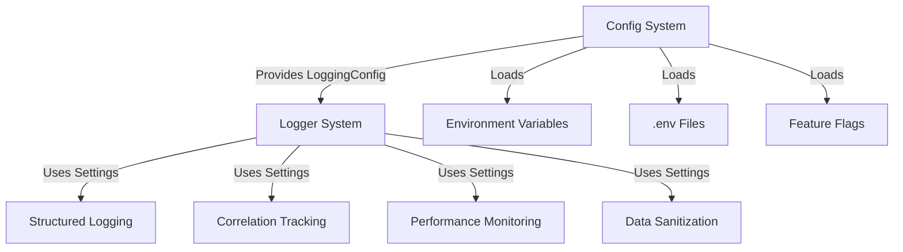

# Config & Logger Integration Guide

## Overview
The configuration and logging systems are tightly integrated to provide consistent, configurable logging across the Trivya platform.

## Architecture



## Usage

### Basic Integration

```python
from shared.core_functions.config import Config
from shared.core_functions.logger import TrivyaLogger

# Initialize with default config
config = Config()
logger = TrivyaLogger(config)

# Get logger for component
component_logger = logger.get_logger("my_component")
component_logger.info("Component initialized")
```

### Environment-Specific Configuration

```python
# Development environment
import os
os.environ['LOG_LEVEL'] = 'DEBUG'
os.environ['LOG_OUTPUT'] = 'console'

config = Config()
logger = TrivyaLogger(config)

# Production environment
os.environ['LOG_LEVEL'] = 'WARNING'
os.environ['LOG_OUTPUT'] = 'file'
os.environ['LOG_FILE_PATH'] = '/var/log/trivya/production.log'

config = Config()
logger = TrivyaLogger(config)
```

### Feature Flag Integration

```python
# Check if enhanced logging is enabled
config = Config()
flags = config.get_feature_flags('mini')

if flags.get('enhanced_logging', False):
    logger = TrivyaLogger(config)
    logger.log_performance("component", "metric", value)
```

## Configuration Options

### Environment Variables

| Variable | Values | Default | Description |
|----------|--------|---------|-------------|
| `LOG_LEVEL` | DEBUG, INFO, WARNING, ERROR, CRITICAL | INFO | Logging level |
| `LOG_FORMAT` | json, text | json | Log output format |
| `LOG_OUTPUT` | console, file, both | console | Output destination |
| `LOG_FILE_PATH` | path string | logs/trivya.log | Log file location |
| `LOG_MAX_FILE_SIZE` | size string | 10MB | Maximum log file size |
| `LOG_BACKUP_COUNT` | 1-50 | 5 | Number of backup files |
| `LOG_CORRELATION_TRACKING` | true, false | true | Enable correlation IDs |
| `LOG_PERFORMANCE_MONITORING` | true, false | true | Enable performance logs |
| `LOG_SANITIZE_SENSITIVE_DATA` | true, false | true | Enable data sanitization |

### Configuration via Code

```python
from shared.core_functions.config import LoggingConfig

# Create custom logging config
log_config = LoggingConfig(
    LOG_LEVEL="DEBUG",
    LOG_FORMAT="json",
    LOG_OUTPUT="both",
    LOG_FILE_PATH="/custom/path/app.log",
    LOG_CORRELATION_TRACKING=True,
    LOG_PERFORMANCE_MONITORING=True,
    LOG_SANITIZE_SENSITIVE_DATA=True
)
```

## Integration Examples

### Example 1: Basic Agent Logging

```python
from shared.core_functions.config import Config
from shared.core_functions.logger import TrivyaLogger

# Setup
config = Config()
logger = TrivyaLogger(config)

# Log agent action
logger.log_agent_action(
    agent_id="faq_agent_001",
    action="processed_request",
    customer_id="cust_123",
    response_time=0.45
)
```

### Example 2: Workflow with Correlation Tracking

```python
# Create correlation ID for tracking
correlation_id = logger.create_correlation_id()

# Log multiple steps with same correlation ID
logger.log_workflow_step(
    workflow_id="ticket_001",
    step="received",
    correlation_id=correlation_id
)

logger.log_workflow_step(
    workflow_id="ticket_001",
    step="processed",
    correlation_id=correlation_id
)

logger.log_workflow_step(
    workflow_id="ticket_001",
    step="resolved",
    correlation_id=correlation_id
)
```

### Example 3: Performance Monitoring

```python
from shared.core_functions.logger import PerformanceTimer

# Using context manager
with PerformanceTimer(logger, "database", "query", correlation_id):
    # Your database operation
    result = db.query(...)

# Manual logging
logger.log_performance(
    component="api",
    metric="response_time",
    value=0.234,
    correlation_id=correlation_id
)
```

### Example 4: Secure Logging

```python
# Sensitive data is automatically sanitized
user_data = {
    "user_id": "user_123",
    "email": "john@example.com",
    "password": "secret123",  # Will be redacted
    "api_key": "sk_live_abc"  # Will be redacted
}

logger.log_agent_action(
    agent_id="auth_agent",
    action="user_login",
    **user_data
)
# Output: password and api_key will be "***REDACTED***"
```

## Feature Flags

### Enhanced Logging Flag

```json
{
  "enhanced_logging": true,
  "debug_mode": false,
  "performance_tracking": true
}
```

Usage:

```python
config = Config()
flags = config.get_feature_flags('mini')

if flags.get('enhanced_logging'):
    # Enable additional logging features
    logger.log_performance(...)
    
if flags.get('debug_mode'):
    # Enable debug logging
    os.environ['LOG_LEVEL'] = 'DEBUG'
    config = Config()  # Reload config
```

## Best Practices

### 1. Use Correlation IDs

Always use correlation IDs to track requests across components:

```python
correlation_id = logger.create_correlation_id()
logger.log_agent_action(..., correlation_id=correlation_id)
logger.log_workflow_step(..., correlation_id=correlation_id)
```

### 2. Component-Specific Loggers

Create separate loggers for different components:

```python
faq_logger = logger.get_logger("faq_agent")
billing_logger = logger.get_logger("billing_agent")
workflow_logger = logger.get_logger("workflow_engine")
```

### 3. Performance Monitoring

Use PerformanceTimer for automatic timing:

```python
with PerformanceTimer(logger, "component", "operation", correlation_id):
    # Your code here
    pass
```

### 4. Structured Logging

Always use structured data in logs:

```python
logger.log_agent_action(
    agent_id="agent_001",
    action="processed",
    customer_id="cust_123",
    response_time=0.45,
    confidence_score=0.95
)
```

### 5. Environment-Specific Settings

Use different settings for different environments:

```bash
# Development
LOG_LEVEL=DEBUG
LOG_OUTPUT=console

# Production
LOG_LEVEL=WARNING
LOG_OUTPUT=file
LOG_FILE_PATH=/var/log/trivya/production.log
```

## Troubleshooting

### Issue: Logs not appearing

**Solution**: Check LOG_OUTPUT setting and file permissions

```python
# Verify config
config = Config()
print(config.logging_config.LOG_OUTPUT)
print(config.logging_config.LOG_FILE_PATH)
```

### Issue: Sensitive data in logs

**Solution**: Ensure sanitization is enabled

```python
# Verify sanitization
config = Config()
assert config.logging_config.LOG_SANITIZE_SENSITIVE_DATA is True
```

### Issue: Performance overhead

**Solution**: Adjust log level and disable unnecessary features

```bash
LOG_LEVEL=WARNING
LOG_PERFORMANCE_MONITORING=false
```

## Testing Integration

### Unit Tests

```python
def test_config_logger_integration():
    config = Config()
    logger = TrivyaLogger(config)
    
    assert logger.config.logging_config.LOG_LEVEL == "INFO"
    assert logger.config.logging_config.LOG_FORMAT == "json"
```

### Integration Tests

```python
def test_full_integration():
    # Setup
    config = Config()
    logger = TrivyaLogger(config)
    
    # Test logging
    logger.log_agent_action(
        agent_id="test",
        action="test_action"
    )
    
    # Verify log file created
    assert Path(config.logging_config.LOG_FILE_PATH).exists()
```

## Next Steps

1. **Implement Security Module**: Create `shared/core_functions/security.py`
2. **Add Monitoring**: Integrate with Prometheus/Grafana
3. **Enhance Performance**: Add async logging support
4. **Extend Documentation**: Add more examples and use cases
5. **Create Dashboards**: Build log analysis dashboards

## References

- [Config System Documentation](../config.md)
- [Logger System Documentation](../logger.md)
- [Feature Flags Documentation](../feature_flags.md)
- [Testing Guide](../testing.md)

---

**Integration Status**: ✅ Complete and Tested

**Last Updated**: 2025-11-26

**Version**: 1.0.0
