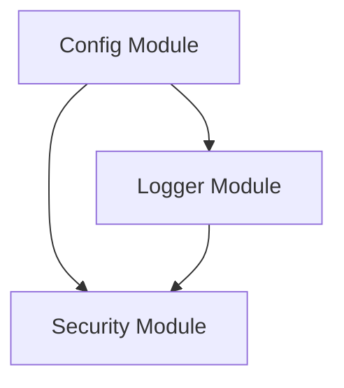

# Config + Logger + Security Integration Guide

## Overview

This document explains how the three core modules of the Trivya Platform—**Config**, **Logger**, and **Security**—integrate to provide a secure, observable, and configurable foundation for the application.

## Architecture

The three modules form a dependency triangle:

1. **Config**: The base module. Loads settings from environment variables, `.env` files, and feature flags.
2. **Logger**: Depends on Config. Uses settings to configure log level, format, and output.
3. **Security**: Depends on Config and Logger. Uses Config for security settings (keys, limits) and Logger for audit trails.



## Integration Points

### 1. Configuration Flow

Settings flow from the `Config` module to `Logger` and `Security`.

**Logger Configuration:**
- `LOG_LEVEL` -> Sets logging verbosity
- `LOG_FORMAT` -> JSON or text format
- `LOG_OUTPUT` -> Console, file, or both

**Security Configuration:**
- `JWT_SECRET_KEY` -> Token signing
- `ENCRYPTION_KEY` -> Data encryption
- `RATE_LIMIT_*` -> Rate limiting rules
- `PASSWORD_*` -> Password complexity rules

### 2. Logging & Audit Trails

The Security module uses the Logger to create an audit trail of all security-critical operations.

**Logged Events:**
- Authentication (Login, Token Generation)
- Authorization (Token Validation)
- Data Protection (Encryption/Decryption)
- Rate Limiting (Throttling)
- Key Management (API Key Generation)

**Correlation Tracking:**
- Correlation IDs are passed from the entry point (e.g., API request) through the Security module to the Logger.
- This ensures that a single user request can be traced across all security operations.

### 3. Data Sanitization

The Logger automatically sanitizes sensitive data passed from the Security module.

**Sanitized Fields:**
- `password`
- `token`
- `api_key`
- `secret`
- `credit_card`
- `jwt`

**Example:**
If `security.validate_jwt_token(token="abc")` is called, the logger receives the token but outputs `token: "***REDACTED***"` in the logs.

## Usage Examples

### Initialization

Initialize the modules in the correct order:

```python
from shared.core_functions.config import Config
from shared.core_functions.logger import TrivyaLogger
from shared.core_functions.security import TrivyaSecurity

# 1. Initialize Config first
config = Config()

# 2. Initialize Logger with Config
logger = TrivyaLogger(config)

# 3. Initialize Security with Config (it will internally use the singleton Logger)
security = TrivyaSecurity(config)
```

### Complete Workflow Example

```python
# Create a correlation ID for the request
correlation_id = logger.create_correlation_id()

# 1. Hash Password (Logged with correlation ID)
hashed = security.hash_password("UserPass123!", correlation_id=correlation_id)

# 2. Generate Token (Logged)
token = security.generate_jwt_token(
    user_id="user_123", 
    correlation_id=correlation_id
)

# 3. Encrypt Data (Logged)
encrypted = security.encrypt_data("sensitive_info", correlation_id=correlation_id)
```

## Troubleshooting

### Common Issues

**1. "JWT_SECRET_KEY not configured" Error**
- **Cause**: The `Config` module failed to load the `JWT_SECRET_KEY` from environment variables.
- **Fix**: Ensure `.env` file exists or env var is set. Check `Config` initialization.

**2. Logs contain "***REDACTED***" for non-sensitive data**
- **Cause**: A log key contains a sensitive keyword (e.g., "token_validation" contains "token").
- **Fix**: Rename the key in the log call (e.g., use "validation_status").

**3. Feature Flags not working in Security**
- **Cause**: `FEATURE_FLAGS_DIR` is not set or JSON file is missing.
- **Fix**: Verify `Config` loaded flags correctly using `config.get_feature_flags()`.

## Testing

Run the integration tests to verify the system:

```bash
# Run all integration tests
python -m pytest tests/integration/

# Run specific integration test
python -m pytest tests/integration/test_config_logger_security_integration.py
```
